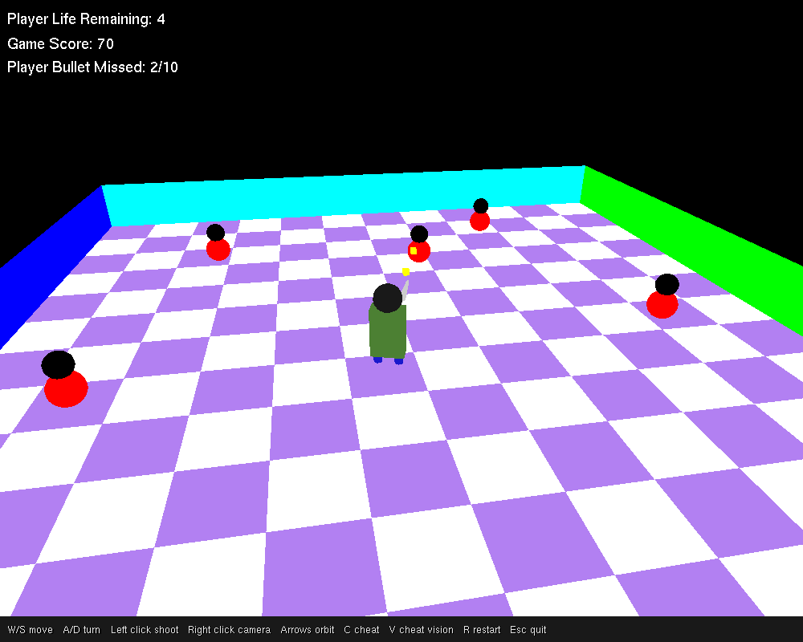
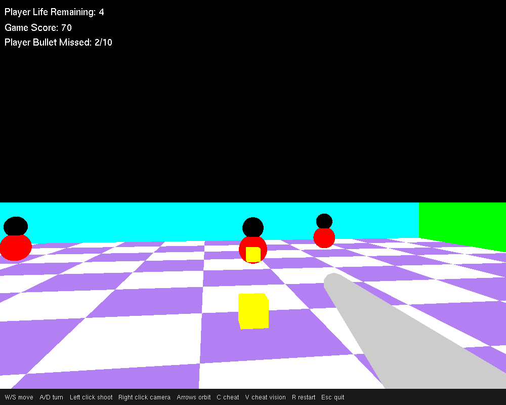
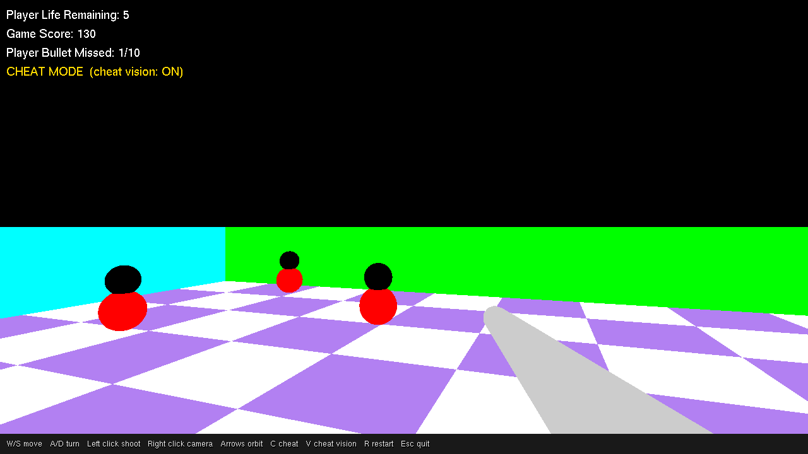
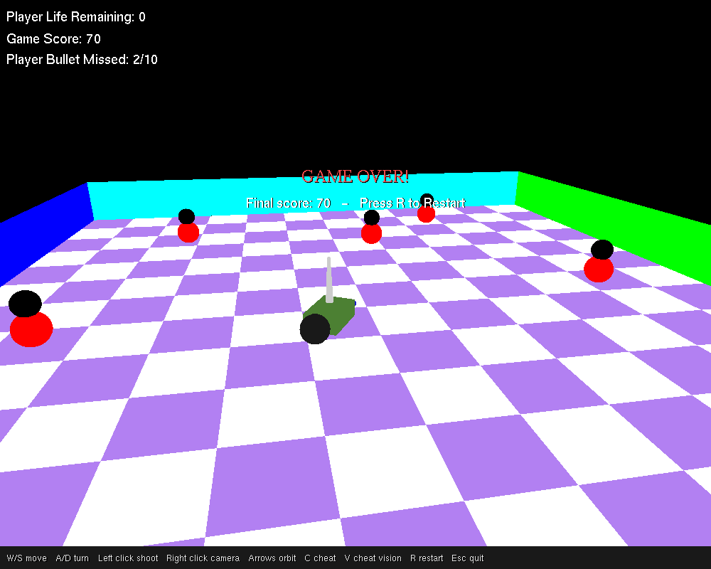

# Bullet Frenzy 3D

A 3D arena shooter written in Python with **PyOpenGL** and **GLUT**, using classic fixed-function OpenGL and no game engine.



Enemies spawn around a walled, checkered arena and close in on you. Shoot them before they reach you, but aim carefully: every bullet that leaves the arena counts as a miss. Lose all your lives or miss 10 shots and the game is over.

## Features

- **Two cameras**: a third-person camera you can orbit and raise or lower, and a first-person view from the player's eyes.
- **Chasing enemies** that pulse as they move and respawn somewhere new after every kill.
- **Cheat mode**: the gun spins by itself and fires only when a shot is certain to hit. **Cheat vision** makes the first-person camera turn with the spinning gun.
- **Same speed on every machine**: the game logic runs in fixed 240 Hz steps, so it plays the same on a 60 Hz laptop and a high-refresh gaming monitor.
- Resizable window, an on-screen HUD with a controls bar, and instant restart.

| First-person view | Cheat vision | Game over |
| --- | --- | --- |
|  |  |  |

## Controls

| Input | Action |
| --- | --- |
| `W` / `S` | Move forward / backward |
| `A` / `D` | Turn left / right |
| Left click | Shoot |
| Right click | Switch between first-person and third-person camera |
| `↑` / `↓` | Raise / lower the third-person camera |
| `←` / `→` | Orbit the third-person camera around the arena |
| `C` | Toggle cheat mode |
| `V` | Toggle cheat vision (first-person camera turns with the gun in cheat mode) |
| `R` | Restart |
| `Esc` | Quit |

## Rules

- You start with **5 lives**. An enemy that reaches you costs one life.
- Each enemy destroyed is worth **10 points**.
- **10 missed bullets** ends the game, as does running out of lives.

## Getting started

You need **Python 3.8+** and a graphics driver that supports OpenGL.

```bash
git clone https://github.com/sandipkumarpaul/bullet-frenzy-3d.git
cd bullet-frenzy-3d
python -m venv .venv
```

Activate the virtual environment:

- Windows: `.venv\Scripts\activate`
- macOS / Linux: `source .venv/bin/activate`

Then install the dependency and play:

```bash
pip install -r requirements.txt
python bullet_frenzy.py
```

### Platform notes

- **Windows**: PyOpenGL ships with the freeglut DLLs, so nothing else is needed. Tested on Windows 11 with Python 3.14 and PyOpenGL 3.1.10.
- **Linux**: install freeglut from your package manager, e.g. `sudo apt install freeglut3-dev` (Debian/Ubuntu) or `sudo dnf install freeglut-devel` (Fedora).
- **macOS**: should work with the system GLUT framework, but hasn't been tested.

If you get `NullFunctionError: Attempt to call an undefined function glutInit`, PyOpenGL couldn't find a GLUT library. Install freeglut as described above, or upgrade PyOpenGL with `pip install -U PyOpenGL`.

## How it works

Everything lives in [`bullet_frenzy.py`](bullet_frenzy.py), in three parts:

1. **Game state and rules**: the `Game` class holds the player, enemies, bullets, score and cheat flags, and `Game.update(dt)` moves the world forward by `dt` seconds. It contains no OpenGL code, so the rules can be tested without opening a window.
2. **Rendering**: the `draw_*` functions build the scene out of GLUT/GLU primitives (cubes, spheres, cylinders) with immediate-mode OpenGL. The HUD is drawn afterwards in an orthographic 2D projection with depth testing turned off.
3. **GLUT callbacks**: keyboard and mouse input call methods on `Game`. The idle callback measures how much real time has passed and runs the simulation in fixed 1/240 s steps. Fixed steps keep the speed independent of frame rate and keep fast bullets from jumping past an enemy between frames.

Collisions are 2D distance checks on the arena floor. In cheat mode, the gun fires when an enemy's distance from the line of fire is within the hit radius. Checking only the angle would miss far-away enemies.

All tuning values (speeds, arena size, lives, miss limit and so on) are constants at the top of the file.

## License

Released under the [MIT License](LICENSE).
